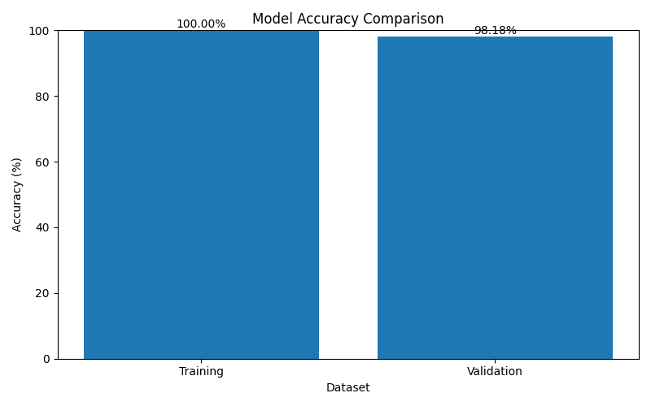
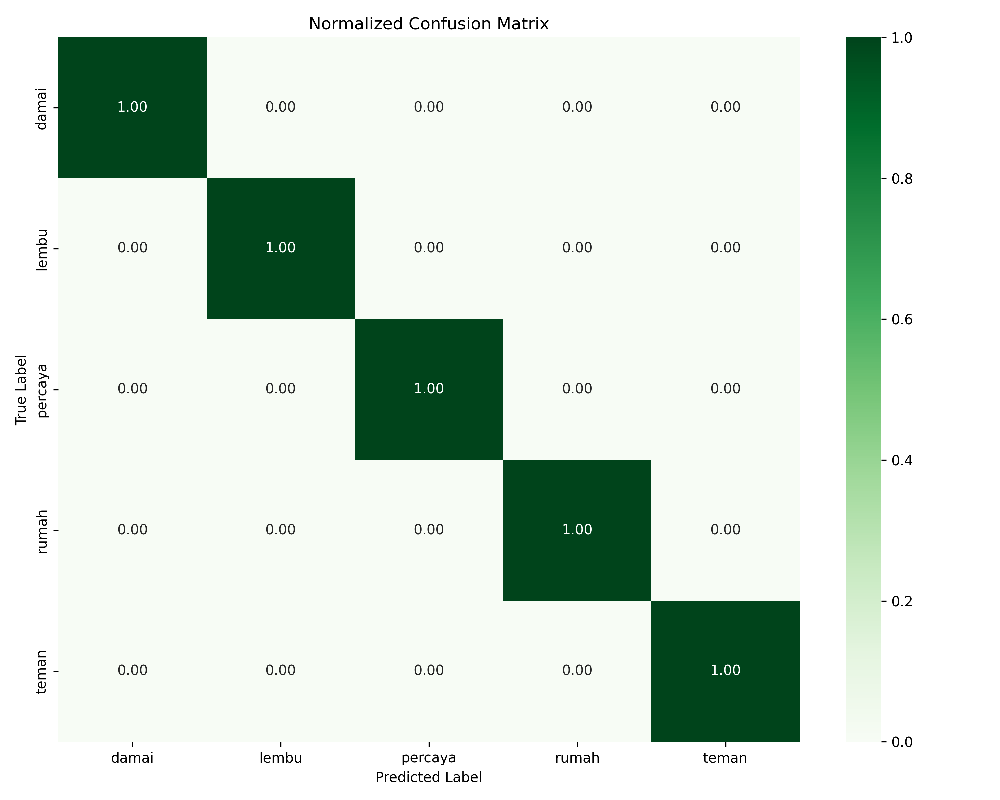
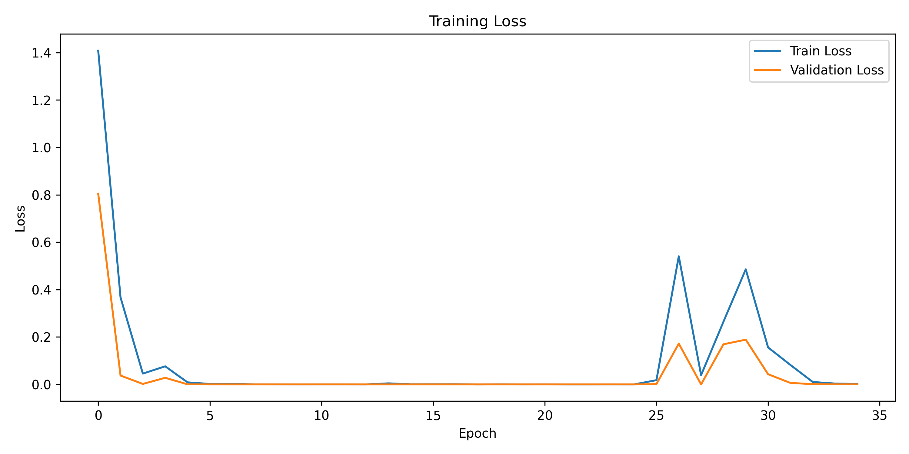

# 🤟 Real-Time Sign Language Recognition

<p align="center">
  
</p>

<p align="center">


</p>

<p align="center">
A real-time Indonesian Sign Language Recognition System built with Computer Vision, Machine Learning, Deep Learning, FastAPI, and a Web Interface.
</p>

---

# 📑 Table of Contents

- Overview
- Demo
- Features
- Model Performance
- Results
- Technology Stack
- System Architecture
- Machine Learning Pipeline
- Dataset
- Project Structure
- Installation
- API Endpoints
- Future Improvements
- Author

---

# 📖 Overview

This project recognizes Indonesian Sign Language in real time using a webcam.

It supports:

- Static alphabet recognition (A–Z)
- Static number recognition (0–9)
- Dynamic word recognition:
  - Damai
  - Lembu
  - Percaya
  - Rumah
  - Teman

MediaPipe extracts 21 hand landmarks. Random Forest classifies static gestures while a GRU network recognizes dynamic gestures. FastAPI serves predictions to a web application.

---

# 🎥 Demo

> Add your demo GIF here.

```md
<p align="center">

</p>
```

---

# ✨ Features

| Feature | Status |
|---|:---:|
| Webcam Detection | ✅ |
| Alphabet Recognition | ✅ |
| Number Recognition | ✅ |
| Dynamic Word Recognition | ✅ |
| FastAPI Backend | ✅ |
| REST API | ✅ |
| Web Interface | ✅ |

---

# 📊 Model Performance

| Task | Model | Training | Validation |
|---|---|---:|---:|
| Alphabet | Random Forest | 100.00% | **98.18%** |
| Number | Random Forest | 100.00% | **94.31%** |
| Words | GRU | 100.00% | **100.00%** |

---

# 📈 Results

## Alphabet


## Number


## Word


## Confusion Matrix


## Normalized Confusion Matrix


## Training Accuracy


## Training Loss


---

# 🛠 Technology Stack

- Python
- OpenCV
- MediaPipe
- Scikit-learn
- TensorFlow / Keras
- Random Forest
- GRU
- FastAPI
- HTML
- CSS
- JavaScript

---

# 🏗 System Architecture

```text
Webcam
   │
   ▼
MediaPipe Hand Detection
   │
   ▼
Feature Extraction
   │
   ├────────► Random Forest (Alphabet & Number)
   │
   └────────► GRU (Words)
                 │
                 ▼
             FastAPI API
                 ▼
           Web Application
                 ▼
        Real-time Prediction
```

---

# 🧠 Machine Learning Pipeline

## Static

Image → MediaPipe → Landmark Extraction → Position & Scale Normalization → 126 Features → Random Forest → Prediction

## Dynamic

30 Frames → MediaPipe → Landmark Extraction → (30×126) Sequence → GRU → Prediction

---

# 📂 Dataset

### Alphabet
- Kaggle Dataset

### Numbers
- Self-collected using webcam.

### Words
- Damai
- Lembu
- Percaya
- Rumah
- Teman

Each word:
- 100 sequences
- 30 frames per sequence

---

# 📁 Project Structure

```text
real-time-sign-language-recognition/
├── api/
├── dataset/
├── models/
├── results/
├── web/
├── requirements.txt
└── README.md
```

---

# 🚀 Installation

```bash
git clone https://github.com/tasyaulfarahmazani/real-time-sign-language-recognition.git
cd real-time-sign-language-recognition
pip install -r requirements.txt
uvicorn api.main:app --reload
```

Open:

```
http://127.0.0.1:8000
```

---

# 🔌 API

| Endpoint | Method | Description |
|---|---|---|
| /predict | POST | Predict alphabet and numbers |
| /predict-dynamic | POST | Predict dynamic words |

---

# 🚀 Future Improvements

- More BISINDO vocabulary
- Sentence recognition
- Mobile application
- Cloud deployment
- Better robustness in different lighting

---

# 👩‍💻 Author

**Tasya Ulfa Rahmazani**

Informatics Engineering Student  
Department of Information and Computer Technology  
Politeknik Negeri Lhokseumawe

- GitHub: https://github.com/tasyaulfarahmazani
- Email: tasyaulfarahmazani03@gmail.com
